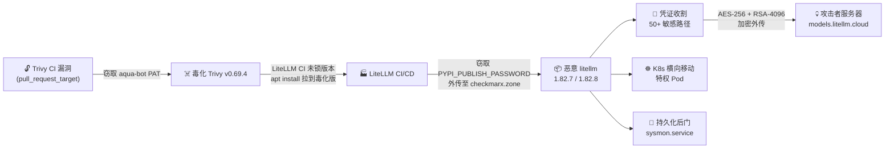

> 2026 年 3 月 24 日，月下载量 9500 万的 litellm 被植入后门，恶意版本存活约 3 小时。如果你的项目直接或间接依赖它，这篇文章帮你判断是否受影响，以及怎么保护自己。

---

{: .prompt-info }
> **30 秒速览** — LiteLLM `1.82.7` / `1.82.8` 被植入后门，窃取云凭证、SSH 密钥、K8s 令牌。终端执行 `pip show litellm` 查看版本，`1.82.7` 或 `1.82.8` 需立即处置。安全版本：≤ `1.82.6`。
> [↓ 自查章节](#你受影响了吗) \| [↓ 应急处置](#中招了怎么办)

---

## 攻击链全景

下图展示了从 Trivy 被入侵到 litellm 用户被攻击的完整链路：



---

## 事件概述

**litellm** 是 Python 生态中最流行的 LLM 统一调用库——OpenAI、Anthropic、Google、AWS Bedrock 等几十个模型供应商，一套代码调用。据 Wiz 数据，litellm 存在于 **36% 的云环境**中，月下载量 **9500 万**。

3 月 24 日，攻击组织 **TeamPCP**（别名 PCPcat / ShellForce / DeadCatx3）发动了一次精密的供应链攻击，推送了两个恶意版本：

- **1.82.7**：恶意代码在 `proxy_server.py` 中，import 时触发
- **1.82.8**（更危险）：增加了 `.pth` 文件，**只要启动 Python 就会执行，不需要 import litellm**

两个版本已从 PyPI 下架。**受影响时间窗口：3 月 24 日 10:39-16:00 UTC（约 3 小时）。**

## 攻击链：从安全工具到 PyPI

这次攻击的精妙之处在于它的入口——不是 LiteLLM 本身，而是它 CI/CD 中的安全扫描工具 **Trivy**。攻击者利用 Trivy 的 `pull_request_target` workflow 漏洞窃取了 aqua-bot 的 PAT，发布了恶意 Trivy v0.69.4。LiteLLM 的 CI/CD 未锁定 Trivy 版本，`apt install` 拉到了毒化版本——Trivy 中的窃取器在 CI 环境内运行，提取了 `PYPI_PUBLISH_PASSWORD`，最终让 TeamPCP 直接往 PyPI 推送了恶意包。

**讽刺的是：用来保护供应链安全的工具，反而成了供应链攻击的入口。**

## 恶意载荷：三阶段攻击

### 阶段一：凭证收割

恶意代码会扫描 **50+ 个敏感路径**，包括但不限于：

- **云凭证**：AWS credentials、GCP gcloud 配置、Azure tokens
- **密钥文件**：SSH 密钥、Kubernetes config、`.env` 文件
- **加密货币钱包**：搜索常见钱包路径
- **进程内存**：刮取 `/proc/<pid>/mem` 中的密钥（这比扫描文件更彻底——即使你没把密钥写在文件里，只要进程内存中有，也会被提取）
- **所有环境变量**：包括 API Key、数据库密码等

数据通过 **AES-256-CBC 随机会话密钥 + RSA-4096 公钥**加密，打包成 `tpcp.tar.gz`，上传至 `models.litellm[.]cloud`。

更狡猾的是，攻击者还有一个**备用外传通道**：利用受害者的 GitHub 账号凭证，创建一个名为 `tpcp-docs` 的仓库，把窃取的数据作为 release asset 上传。如果你发现自己的 GitHub 账号下多了一个 `tpcp-docs` 仓库，说明已经中招。

### 阶段二：Kubernetes 横向移动

如果检测到 Kubernetes 环境：

1. 利用 service account token 枚举集群所有节点
2. 在每个节点部署名为 `node-setup-{node_name}` 的**特权 Pod**
3. 通过 chroot 进入宿主机文件系统，获取完整控制权

### 阶段三：持久化后门

安装 systemd 服务 `sysmon.service`（伪装成"系统遥测"服务），每 50 分钟轮询 `checkmarx[.]zone/raw` 获取新指令。Kill switch：如果返回的 URL 包含 `youtube[.]com`，则中止执行。

**即使你卸载了 litellm，后门仍然在系统中运行。**

### 1.82.8 的特殊危险性

v1.82.8 在 `site-packages/` 目录放入了 `litellm_init.pth` 文件。Python 的 `.pth` 机制会在解释器启动时由 `site.py` 自动处理——这意味着**即使你从未 import litellm，恶意代码也会在每一个 Python 进程中执行**。而且它通过 `subprocess.Popen` 在后台子进程中运行，几乎不可察觉。

## 你受影响了吗？

### 快速判断

先回答一个问题：**你用 litellm 吗？**

终端里执行 `pip show litellm`：

- **没安装** → ✅ 基本安全（但建议检查间接依赖，很多 AI 框架会偷偷拉它）
- **版本 ≤ 1.82.6 且 3 月 24 日没做过 pip install** → ✅ 不受影响
- **版本是 1.82.7 或 1.82.8** → 🔴 确认中招，立即处置
- **使用官方 Docker 镜像** `ghcr.io/berriai/litellm` → ✅ 不受影响（依赖版本锁定）
- **使用 LiteLLM Cloud** → ✅ 不受影响

### 深度自查（5 项检查）

即使你认为自己没中招，也建议跑一遍：

**① 检查 .pth 文件（最关键）**

在终端搜索 `litellm_init.pth`。这是 v1.82.8 的攻击向量——Python 启动就自动执行。找到就说明确认被入侵。

**② 检查持久化后门**

看看 `~/.config/sysmon/` 目录是否存在，以及是否有名为 `sysmon.service` 的 systemd 服务。同时检查 `/tmp/tpcp.tar.gz`、`/tmp/pglog`、`/tmp/.pg_state` 这些外传相关的临时文件。

**③ 检查可疑网络连接**

在网络日志或防火墙日志中搜索两个域名：
- `models.litellm[.]cloud` — 数据外泄目标（不是 LiteLLM 官方域名）
- `checkmarx[.]zone` — 后门 C2 服务器

**④ 检查 GitHub 账号**

登录 GitHub，看看是否有你不认识的 `tpcp-docs` 仓库。攻击者会利用窃取的凭证创建这个仓库作为备用外传通道。

**⑤ Kubernetes 环境**

在 `kube-system` namespace 中搜索名为 `node-setup-*` 的 Pod。这些是攻击者部署的特权容器。

### 关键 IoC（入侵指标）

| 类型 | 指标 |
|------|------|
| 恶意包 | `litellm==1.82.7`、`litellm==1.82.8` |
| SHA-256 (1.82.7) | `8395c3268d5c5dbae1c7c6d4bb3c318c752ba4608cfcd90eb97ffb94a910eac2` |
| SHA-256 (1.82.8) | `d2a0d5f564628773b6af7b9c11f6b86531a875bd2d186d7081ab62748a800ebb` |
| C2 域名 | `models.litellm[.]cloud`、`checkmarx[.]zone` |
| 持久化文件 | `litellm_init.pth`、`~/.config/sysmon/sysmon.py`、`sysmon.service` |
| K8s 指标 | `node-setup-*` pods in `kube-system` |
| 外传文件 | `/tmp/tpcp.tar.gz`、`/tmp/pglog`、`/tmp/.pg_state` |
| GitHub 指标 | 账号下出现 `tpcp-docs` 仓库 |

### 一键自查脚本

把核心检查整合在一起，复制到终端直接跑：

```bash
#!/bin/bash
echo "🔍 LiteLLM 供应链攻击自查"
echo "========================="

echo ""; echo "📦 检查 litellm 安装状态..."
if pip show litellm &>/dev/null; then
    VERSION=$(pip show litellm | grep Version | awk '{print $2}')
    echo "  ⚠️  已安装，版本: $VERSION"
    [[ "$VERSION" == "1.82.7" || "$VERSION" == "1.82.8" ]] && \
        echo "  🔴 危险！已知恶意版本！"
else
    echo "  ✅ 未安装"
fi

echo ""; echo "📄 检查恶意 .pth 文件..."
PTH=$(find / -name "litellm_init.pth" 2>/dev/null)
[ -n "$PTH" ] && echo "  🔴 发现: $PTH" || echo "  ✅ 未发现"

echo ""; echo "🔧 检查持久化后门..."
FOUND=0
[ -f "$HOME/.config/sysmon/sysmon.py" ] && echo "  🔴 发现后门脚本" && FOUND=1
[ -f "$HOME/.config/systemd/user/sysmon.service" ] && echo "  🔴 发现后门服务" && FOUND=1
[ -f "/tmp/tpcp.tar.gz" ] && echo "  🔴 发现外传文件" && FOUND=1
[ $FOUND -eq 0 ] && echo "  ✅ 未发现"

echo ""; echo "🔎 检查可疑进程..."
PROCS=$(ps aux 2>/dev/null | grep -E "sysmon|checkmarx" | grep -v grep)
[ -n "$PROCS" ] && echo "  🔴 $PROCS" || echo "  ✅ 未发现"

echo ""; echo "☸️  检查 K8s 恶意 Pod..."
if command -v kubectl &>/dev/null; then
    PODS=$(kubectl get pods -n kube-system 2>/dev/null | grep node-setup)
    [ -n "$PODS" ] && echo "  🔴 发现恶意 Pod: $PODS" || echo "  ✅ 未发现"
else
    echo "  ⏭️  未安装 kubectl，跳过"
fi

echo ""; echo "========================="
echo "⚠️  即使全部通过，如果 3月24日 10:39-16:00 UTC"
echo "期间执行过未锁定版本的 pip install litellm，"
echo "仍建议轮换所有凭证。"
echo ""
echo "另外请手动检查 GitHub 账号是否有 tpcp-docs 仓库。"
```

## 中招了怎么办

按优先级处置：

### 🔴 立即执行

1. **隔离主机**——断网或限制出站流量
2. **删除恶意文件**——卸载 litellm，删除 `litellm_init.pth`，删除 `~/.config/sysmon/` 目录
3. **停止后门服务**——停止并删除 `sysmon.service`
4. **重装安全版本**——`pip install litellm==1.82.6`
5. **K8s 环境**——删除所有 `node-setup-*` Pod
6. **检查 GitHub**——删除 `tpcp-docs` 仓库（如存在）

### 🟠 24 小时内完成

**轮换所有凭证**——这是最重要的一步。攻击的第一阶段就是把所有凭证打包加密发给攻击者了，即使你删了恶意代码，凭证已经泄露：

- AWS/GCP/Azure 凭证 → 在各云控制台重新生成
- SSH 密钥 → 重新生成密钥对
- Kubernetes Token → 删除并重建 Service Account
- API Key（OpenAI/Anthropic 等）→ 在平台重新生成
- 数据库密码 → 重置
- `.env` 中的所有变量 → 全部重新生成

### 🟡 一周内完成

- 审计 CI/CD 流水线中所有依赖的版本锁定情况
- 检查 Docker 构建日志
- 审查网络日志，评估数据泄露范围
- 全面检查是否还有其他 TeamPCP 相关的 IoC

## 为什么 API 代理是高价值目标

这次事件揭示了一个架构层面的风险：**LiteLLM 本质上是一个 API 密钥集中器。**

它的价值在于帮你统一管理 OpenAI、Anthropic、Google 等十几家模型厂商的 API Key。但正因为如此，**攻破一个 LiteLLM 实例 = 同时偷到你所有厂商的密钥**。这就是为什么攻击者会花这么大力气去入侵它。

问题的根源不在 LiteLLM 团队不努力，而在于架构模式：当你选择自建开源 API 代理，你就需要独自承担供应链安全、密钥管理、版本监控、应急响应的全部责任。对大多数团队来说，这不现实。

### 更安全的做法：托管服务

比起在自己的环境里部署一个 API 代理（然后祈祷它不被投毒），更安全的思路是用托管的 AI 接口服务。

以 [OfoxAI](https://ofox.ai/zh?utm_source=blog&utm_medium=post&utm_campaign=litellm_security) 为例：

<table>
<thead>
<tr><th>风险维度</th><th style="background:#fff0f0;color:#c0392b;">自建 LiteLLM ⚠️</th><th style="background:#f0fff0;color:#27ae60;">OfoxAI 托管服务 ✅</th></tr>
</thead>
<tbody>
<tr><td><strong>供应链攻击</strong></td><td style="background:#fff5f5;">CI/CD 被投毒 → 所有 Key 被偷</td><td style="background:#f5fff5;">托管服务，用户不接触 CI/CD 管线</td></tr>
<tr><td><strong>密钥存储</strong></td><td style="background:#fff5f5;">.env 明文 / 自建 Vault</td><td style="background:#f5fff5;">平台侧加密管理，Key 不暴露给用户环境</td></tr>
<tr><td><strong>密钥集中风险</strong></td><td style="background:#fff5f5;">一个实例存十几家厂商 Key，攻破一个全丢</td><td style="background:#f5fff5;">用户只持有一个 OfoxAI 接口凭证</td></tr>
<tr><td><strong>版本升级风险</strong></td><td style="background:#fff5f5;">pip install 可能拉到恶意版本</td><td style="background:#f5fff5;">无需在用户侧安装任何包</td></tr>
<tr><td><strong>安全响应</strong></td><td style="background:#fff5f5;">出事后自己排查 IoC、轮换密钥</td><td style="background:#f5fff5;">平台统一应急响应</td></tr>
<tr><td><strong>调用监控</strong></td><td style="background:#fff5f5;">自建日志系统</td><td style="background:#f5fff5;">内置调用日志和异常检测</td></tr>
<tr><td><strong>维护成本</strong></td><td style="background:#fff5f5;">持续跟进安全公告、打补丁、锁版本</td><td style="background:#f5fff5;">零运维，开箱即用</td></tr>
</tbody>
</table>

核心逻辑很简单：**你只需要一个 OfoxAI 接口凭证，就能直连 Claude、GPT、Gemini、DeepSeek、Qwen 等主流模型。模型厂商的原始 Key 由平台加密托管，不经过你的代码、你的 CI/CD、你的 `.env` 文件。** 即使某天 PyPI 上又出了恶意包，和你也没有关系——因为你根本不需要在自己的环境里安装任何 AI 代理。

> 用开源工具学习和实验没问题，但生产环境的 API 密钥管理，交给专业的托管服务更安全。这不是广告，这是这次供应链攻击给所有 AI 开发者的真实教训。
>
> 👉 [ofox.ai](https://ofox.ai/zh?utm_source=blog&utm_medium=post&utm_campaign=litellm_security) — 一个接口，直连所有主流 AI 模型。

## 怎么防止下次再发生

不管你用不用 LiteLLM，以下措施都适用于所有项目：

### 1. 锁定依赖版本（最重要）

`pip install litellm` 不 pin 版本就是在裸奔。正确做法：

- 使用 lock 文件（`uv lock`、`poetry lock`、`pip-compile --generate-hashes`）
- Lock 文件包含精确版本 + hash 值，即使 PyPI 上的包被替换也会安装失败
- CI/CD 中使用 `--require-hashes` 强制校验

### 2. CI/CD 安全加固

- 依赖锁定到 commit SHA，不用浮动版本标签
- CI 凭证只给必要 scope（最小权限原则）
- PyPI 发布使用 Trusted Publisher（OIDC），不要存 token
- Docker 基础镜像用 digest（`@sha256:...`）而非 tag

### 3. 密钥管理升级

- 用 Vault / Secrets Manager，不用 `.env` 明文存密钥
- PyPI / npm / Docker Hub 账号强制开启 MFA
- 定期轮换所有 API Key 和凭证

### 4. 运行时监控

- 监控 Python 环境的出站连接，拦截异常 C2 域名
- 监控 `.pth` 文件变更——正常开发中很少会动它们
- K8s 环境用 Falco 监控异常容器行为
- 使用供应链扫描工具（Socket.dev / Snyk / Sonatype）

### 5. 构建安全框架

- 每次构建生成 SBOM（软件物料清单）
- 不直接从公共 PyPI/npm 拉取，使用内部镜像仓库
- 采用 SLSA 框架验证构建管线完整性

## 更大的图景

TeamPCP 不只针对 litellm。他们的攻击已经横跨五个生态系统：

**GitHub Actions → Docker Hub → npm → Open VSX → PyPI**

每入侵一个环境，窃取的凭证就指向下一个目标——这就是 Wiz 所说的"雪球效应"：

> Trivy 被入侵 → LiteLLM 被入侵 → 数万环境的凭证泄露 → 这些凭证又指向下一个目标。我们被困在了一个循环里。

更令人担忧的是，TeamPCP 正在与勒索组织 **LAPSUS$** 合作。他们在 Telegram 上公开声明：

> "这些公司的业务就是保护你的供应链，但他们连自己的供应链都保护不了。现代安全研究就是个笑话。我们会持续存在，和新伙伴一起窃取数 TB 的商业机密。"

虽然 TeamPCP 的领导者 "DMT" 近日宣布因心理健康问题退出，但团队明确表示会继续活动。

**这不是孤立事件，是一场持续的、有组织的供应链攻击战役。**

## 事件时间线

| 时间 | 事件 |
|------|------|
| 3月20日前 | TeamPCP 利用 `pull_request_target` 漏洞入侵 Trivy GitHub Action，窃取 aqua-bot PAT |
| 3月20日 | 恶意 Trivy v0.69.4 发布 |
| 3月24日 10:39 UTC | litellm 1.82.7 推送到 PyPI（恶意代码在 proxy_server.py） |
| 3月24日 ~12:00 UTC | litellm 1.82.8 推送（增加 .pth 自动执行，更隐蔽） |
| 3月24日 ~14:00 UTC | 安全研究人员发现异常并开始分析 |
| 3月24日 16:00 UTC | 恶意版本从 PyPI 下架 |
| 3月24日 14:00 ET | LiteLLM 官方发布安全公告，聘请 Google Mandiant 协助调查 |
| 3月24日晚 | Endor Labs、JFrog、Wiz、Snyk、Datadog 等多家安全厂商发布分析报告 |

## 一句话总结

**LiteLLM 事件的教训：锁定版本、校验 hash、最小权限、监控异常、减少依赖。没有银弹，只有层层设防。**

---

> **延伸阅读：**
> - [LiteLLM 官方安全公告](https://docs.litellm.ai/blog/security-update-march-2026)
> - [Wiz — "Three's a Crowd"](https://www.wiz.io/blog/threes-a-crowd-teampcp-trojanizes-litellm-in-continuation-of-campaign)
> - [Rami McCarthy — TeamPCP 完整时间线](https://ramimac.me/teampcp/)
> - [Datadog — 三阶段 payload 技术拆解](https://securitylabs.datadoghq.com/articles/litellm-compromised-pypi-teampcp-supply-chain-campaign/)
> - [Snyk — "Poisoned Security Scanner"](https://snyk.io/articles/poisoned-security-scanner-backdooring-litellm/)
> - [The Hacker News 报道](https://thehackernews.com/2026/03/teampcp-backdoors-litellm-versions.html)
> - [GitHub Issue #24512 — 社区讨论](https://github.com/BerriAI/litellm/issues/24512)
> - [Hacker News 讨论帖](https://news.ycombinator.com/item?id=47501729)
>
> **博客：** [cobb789.ofox.ai](https://cobb789.ofox.ai)
